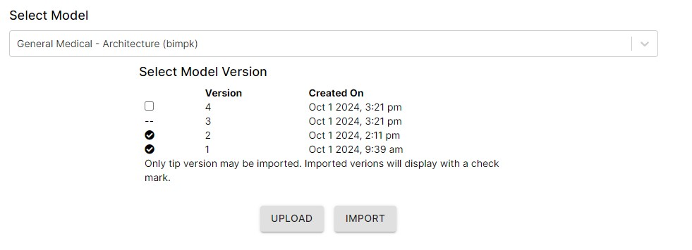

# SimpleModelImportView pageComponent
version dtf-1.1



The SimpleModelImportView provides an easy way to upload .bimpk or .sgpk files, and import their lates versions. You can easily implement the SimpleModelImportView by dropping it in your applications ```app/ipaCore/pageComponents``` folder and adding its configuration to your user configs.

You are free to take the pageComponent and modify for your own purposes and, as with all digitaltwin-factory content, available under the [Apache 2.0 License](../../LICENSE).

## Requirements

In order to use the SimpleModelImportView your ipa-core application must be using ipa-core 3.0 or newer and the @dtplatform 4.3 or newer libraries.

If using the ```create-twinit-app``` npx command to scaffold a new client project for ipa-core, be sure to use the a ```create-twinit-app``` version of 3.0.6 or newer. You can check the version of create-twinit-app that created your current project by going into your project's package.json and finding the dev_twinit field.

* If you do not have a dev_twinit field in your package.json then your project was created using a version prior to 3.0.7.
* If you have a dev_twinit field, check the version number in the createdBy field. It will contain a version like: create-twinit-app@3.0.7.

You must also have created your model import script and orchestrator. For instructions on how to do so, see the __Importing and Managing Models__ chapter in the __Twinit Self-Led Developer Training Intermediate course__.

## Adding SimpleModelImportView to Your Application

To add the pageComponent to your application:

1. Copy the ```modelImport``` folder and its contents from this folder
2. Paste the folder in to your ```app/ipaCore/pageComponents``` folder

## Configuring the SimpleModelImportView

Add the following to your handlers:

```json
"modelImport": {
   "title": "Model Import",
   "icon": "fas fa-file-import fa-2x",
   "shortName": "modelimp",
   "description": "Model Import",
   "pageComponent": "modelImport/SimpleModelImportView",
   "path": "/modelimp",
   "config": {
      "bimpkUserType": "bimpk_importer",
      "sgpkUserType": "sgpk_importer"
   }
}
```

You can provide the _userType of each type of Datasources import orchestrator.

Add the page to your groupedPages so it shows up in the app navigation. An example is below:

```json
"model": {
      "icon": "fas fa-file-import fa-2x",
      "position": 1,
      "pages": [
        {
          "page": "Model Import",
          "handler": "modelImport"
        }
      ]
    }
```

## Using the SimpleModelImportView

1. Select your model. The Select Model dropdown allows you to select the bimpk and sgpk files that have been uploaded to the rootContainer of the project in the File Service.

2. Once a model has been selected the table below will populate the version of the bimpk or sgpk files in the File Service. If a file has not been imported and its the tip (latest) version, you can check the box for it and click the IMPORT button to import the bimpk file. If a file version has already been imported it will display a check. If a file version was not imported while it was the tip (latest) version of the file, then it will display with dashes; '--'. If an orchestrator can't be found for the selected model file, the IMPORT button will disabled.

3. If you have a bimpk or sgpk file, you can upload it directly by using the UPLOAD button. A sample bimpk is included in the [sampleFiles](../../sampleFiles/) folder.

## Want to Visualize Your Imported 3D/2D Model?

Implement the [SimpleViewerView pageComponent](../simpleViewer/README.md)

## Update Log

### version dtf-1.1

* Removed usage of the Mobiscroll library and replaced with a simple list
* Removed unused helper functions

### version dtf-1.0

* First dtf release of the pageComponent
