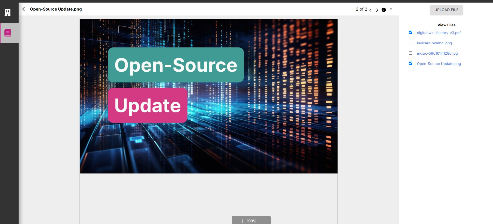

# Simple Doc View pageComponent
version dtf-1.0


The SimpleDocView pageComponent provides an easy to understand example to get started  using Twinit's [IafDocViewer](https://twinit.dev/docs/apis/doc-viewer/overview) component for viewing files in the Twinit File Service in your browser.

You are free to take the pageComponent and modify for your own purposes.

## Requirements

In order to use the SimpleDocView, your ipa-core application must be using ipa-core 3.0 or newer and the @dtplatform 4.3 or newer libraries.

If using the ```create-twinit-app``` npx command to scaffold a new client project for ipa-core, be sure to use the a ```create-twinit-app``` version of 3.0.6 or newer. You can check the version of create-twinit-app that created your current project by going into your project's package.json and finding the dev_twinit field.

* If you do not have a dev_twinit field in your package.json then your project was created using a version prior to 3.0.7.
* If you have a dev_twinit field, check the version number in the createdBy field. It will contain a version like: create-twinit-app@3.0.7.

## Adding SimpleDocView to Your Application

### Adding the pageComponent

To add the pageComponent to your application:

1. Copy the ```simpleDocViewer``` folder and its contents from this folder
2. Paste the folder in to your ```app/ipaCore/pageComponents``` folder

## Configuring the SimpleViewerThemeView

Add the following to your handlers:

```json
"docView": {
   "title": "Doc Viewer",
   "icon": "fas fa-file fa-2x",
   "shortName": "docview",
   "description": "Doc View",
   "pageComponent": "simpleDocViewer/SimpleDocView",
   "path": "/docview",
   "config": {}
}
```

Add the page to your groupedPages so it shows up in the app navigation. An example is below:

```json
"docs": {
   "icon": "fas fa-book fa-2x",
   "position": 2,
   "pages": [
      {
         "page": "Doc Viewer",
         "handler": "docView"
      }
   ]
}
```

## Using the SimpleDocView

1. Click the upload file button and upload a file to your project. The View Files list will update to show the newly uploaded file.

2. To download the file, click the file name in the list.

3. To view the file click the check box for the file, and if the document viewer can display the type of file, it will load the file contents on the page.

4. Check multiple files to view them all and scroll between them in the doc viewer control.

