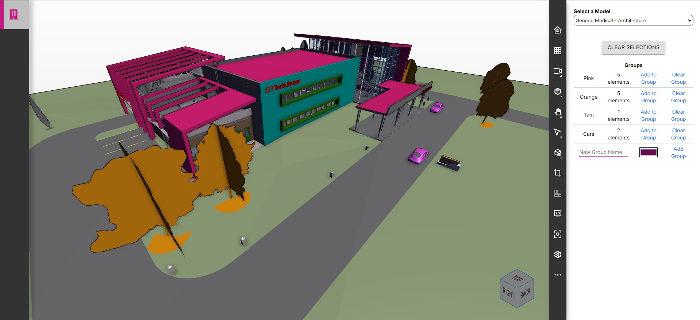

# Simple Viewer Theme View pageComponent
version dtf-1.0



The SimpleViewerThemeView pageComponent provides an easy to understand example to get started using Twinit's IafViewerDBM component for visualizing and interacting with 3D and 2D models. The pageComponent allows you to select from your imported models and view them in the IafViewerDBM. It also allows you to directly select elements in the 3D/2D view and add them to color groups to theme the model.

You are free to take the pageComponent and modify for your own purposes.

## Requirements

In order to use the SimpleViewerThemeView, your ipa-core application must be using ipa-core 3.0 or newer and the @dtplatform 4.3 or newer libraries.

If using the ```create-twinit-app``` npx command to scaffold a new client project for ipa-core, be sure to use the a ```create-twinit-app``` version of 3.0.6 or newer. You can check the version of create-twinit-app that created your current project by going into your project's package.json and finding the dev_twinit field.

* If you do not have a dev_twinit field in your package.json then your project was created using a version prior to 3.0.7.
* If you have a dev_twinit field, check the version number in the createdBy field. It will contain a version like: create-twinit-app@3.0.7.

In order to view 3D/2D models you must also have created an import orchestrator, uploaded a bimpk or sgpk, and used the import orchestrator to import the bmpk or sgpk contents into Twinit. The 'Self-Led Developer Training Intermediate' course on Twinit Academy has a lesson titled 'Importing and Managing Models' which walks you through all three of those steps.

If you have the import orchestrator already created and would like easily upload and import new versions or new bimpks, consider implementing the [SimpleModelImportView pageComponent](https://github.com/Invicara/digitaltwin-factory/tree/master/pageComponents/modelImport).

Plugins for supported CAD applications that can be used to upload bimpks of your own models can downloaded from [the Twinit plugins page](https://apps.invicara.com/ipaplugins/).

## Adding SimpleViewerThemeView to Your Application

### Webpack and script updates to your application

If you used a version of create-twinit-app of 3.0.6 you can skip this step. Otherwise, follow the directions [here](https://twinit.dev/docs/apis/viewer/IafViewerDBM) for updating your webpack configuration and adding the viewer script tag.

### Adding the pageComponent

To add the pageComponent to your application:

1. Copy the ```simpleViewerThemes``` folder and its contents from this folder
2. Paste the folder in to your ```app/ipaCore/pageComponents``` folder

## Configuring the SimpleViewerThemeView

Add the following to your handlers:

```json
"themeView": {
   "title": "Theme odel View",
   "icon": "fas fa-building fa-2x",
   "shortName": "themeview",
   "description": "Theme View",
   "pageComponent": "simpleViewerThemes/SimpleViewerThemeView",
   "path": "/themeview",
   "config": {}
}
```

Add the page to your groupedPages so it shows up in the app navigation. An example is below:

```json
"model": {
   "icon": "fas fa-building fa-2x",
   "position": 1,
   "pages": [
      {
         "page": "Theme View",
         "handler": "themeView"
      }
   ]
}
```

## Using the SimpleViewerThemeView

1. Select an imported model in the 'Select a Model' dropdown.

The viewer will then appear on the left of the page and begin loading the model in the viewer.

2. Once the model has loaded, click on any number of elements in the 3D view. _Note you may want to turn off focus mode in the viewer toolbar to stop the camera from zooming to each selection._

3. Click 'Add to Group' next to a color group to add the elements to that group.

4. You can create a new group by filling in the 'New Group Name' field and picking a new color and clicking Add Group. Any currently selected elements will eb added to the group.